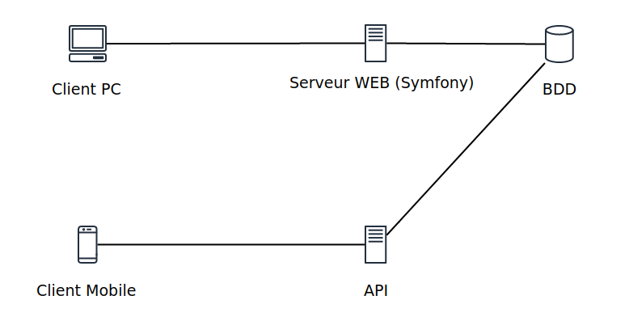

## Qu'est ce qu'est MATETE ?

MATETE est une application mobile et un site web mettant en relation des producteurs de fruits et légumes ou autres produits propres au secteur de l'agriculture avec des particuliers. Cependant MATETE ne gère pas les transactions entre les différents acteurs.

## Fonctionnement :
#### Producteur :
MATETE propose aux personnes travaillant dans le secteur de l'agriculture ou ses divers autres branches de mettre en ligne des annonces en indiquant des informations concernant le lieu de vente ainsi que ses coordonnées(Email et/ou numéro de téléphone).
#### Utilisateur :
 L'utilisateur lui pourra grâce à un système de géolocalisation visualiser les annonces disponible autour de lui.Il pourra aussi trier ces dites annonces grâce à un système de tag où il choisira quels légumes/fruits il souhaite acheté.Après avoir fini sa liste de courses il va pouvoir se rendre au lieu de vente et procéder à l'échange avec le producteur.

## Système de carte

#### Application mobile :

Pour pouvoir afficher une carte et ainsi permettre la localisation des annonces ainsi que le placement des markers.Nous utilisons la librairie publique "[Osmdroid](https://github.com/osmdroid/osmdroid)" 

**disponible sur le GitHUB officiel de osmdroid**.

#### Application web : 

Pour pouvoir afficher une carte et ainsi permettre la localisation des annonces ainsi que le placement des markers.Nous utilisons la librairie publique "[Google Map](https://developers.google.com/maps/documentation/javascript/overview)"

**Disponible sur le site officiel de Google Map.**

## Aperçu Application mobile

## Aperçu Site web


## Pré-requis

### 1. Installer PHP 8.0.11
<a name ="php"></a>
_Linux :_
```shell
$ sudo apt update
$ sudo apt install php8.0 libapache2-mod-php8.0
#Restart Apache2
$ sudo systemctl restart apache2
```
_Windows :_ 

>Disponible sur le site officiel de [PHP](https://www.php.net/downloads)

### 2. Installer MYSQL
_Linux :_
```shell
$ sudo apt update
$ sudo apt-get install mysql-client
```

### 3. Installer Symfony 5.3.9 & Symfony CLI
_Linux :_
```shell
$ sudo wget https://get.symfony.com/cli/installer -O - | bash
```
_Windows & Mac :_

>Disponible sur le site officiel de [Symfony](https://symfony.com/download)

>PS : Plus d'informations sur le site pour l'installation sous linux en cas de soucis.
### 4. Installer Composer 2.1.9
_Linux & Windows :_

>Necessite d'[installer PHP](#php)
```shell
$ sudo php -r "copy('https://getcomposer.org/installer', 'composer-setup.php');"
$ sudo php -r "if (hash_file('sha384', 'composer-setup.php') === '906a84df04cea2aa72f40b5f787e49f22d4c2f19492ac310e8cba5b96ac8b64115ac402c8cd292b8a03482574915d1a8') { echo 'Installer verified'; } else { echo 'Installer corrupt'; unlink('composer-setup.php'); } echo PHP_EOL;"
$ sudo php composer-setup.php
$ sudo php -r "unlink('composer-setup.php');"
# Si composer n'est pas à jour
$ sudo composer self-update
```

## Installation

```shell
$ git clone https://gitlab.com/RomainChardon/matete.git
$ composer update
````

## Schéma d'Architecture Applicative


# Documentation Technique :
### Documentation API
- Découvrez la documentation de l'API (phpDoc) à ce [Lien](docs/API/index.html)
### Documentation Android (JAVA)
- Découvrez la documentation de l'Android (Javadoc) à ce [Lien](gaga)
### Documentation Site web (Symfony)
- Découvrez la documentation du Symfony(phpDoc) à ce [Lien](docs/matete/index.html)

### Version 
- Composer : 2.1.9
- Symfony CLI : v4.26.6
- Symfony : 5.3.9
- PHP : 8.0.11
- MySQL : 8.0.26
